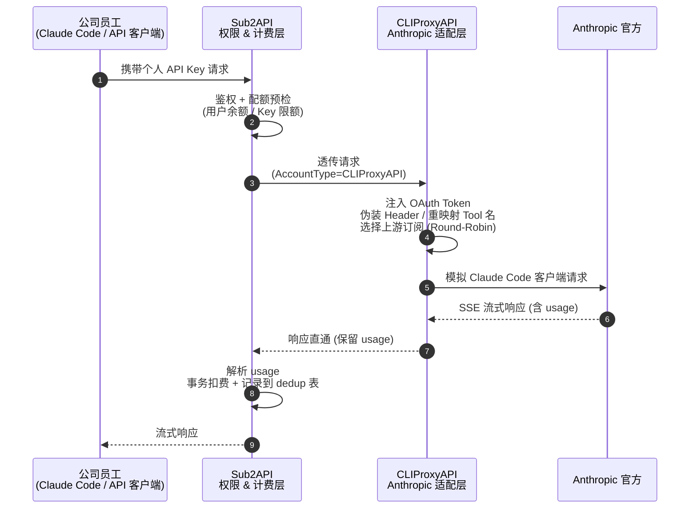
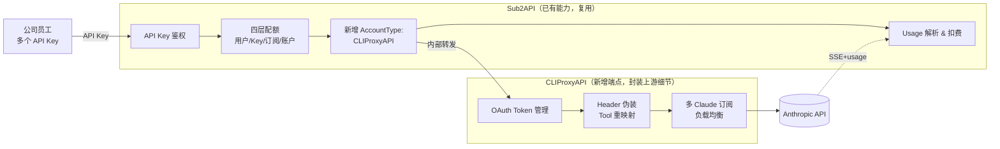

# CLIProxyAPI 集成方案（Sub2API 新增 AccountType）

> 目的：为公司员工提供"Claude 订阅 → API"的转换服务，复用 Sub2API 的鉴权计费能力，把与 Anthropic 的交互细节交给 CLIProxyAPI。

## 方案概述

**核心思路**：把 CLIProxyAPI 当成 Sub2API 的一个新上游端点；在 Sub2API 的 Anthropic Platform 下新增一个 AccountType（类型 = `CLIProxyAPI`），让请求按下面的链路流转。

这不是新发明的模式 —— Sub2API 现有的 "Billing Proxy" AccountType（转发到 `openclaw-billing-proxy`）就是同一种**代理型 AccountType**，本方案只是再加一个具体实现。

## 组件关系图

```
请求方向 ─────────────────────────────────────────────────────────────────────>

┌─────────────┐    ┌──────────────┐    ┌──────────────┐    ┌──────────────┐
│   员工/客户   │ ─> │   Sub2API    │ ─> │ CLIProxyAPI  │ ─> │ Anthropic API │
│  (API Key)   │    │  鉴权 + 计费  │    │ OAuth + 伪装  │    │   (上游)      │
└─────────────┘    └──────────────┘    └──────────────┘    └──────────────┘
                          ▲                                        │
                          └────────── SSE 响应 + usage ────────────┘
                                <────────────────────────

<───────────────────────────────────────────────────────────────── 响应方向
```

## 各组件职责

```
┌────────────────┬──────────────────────────┬─────────────────────────────┐
│     组件        │          职责             │       与上下游的关系          │
├────────────────┼──────────────────────────┼─────────────────────────────┤
│                 │  1. API Key 鉴权          │  入口 ← 员工 (对外 API)       │
│   Sub2API       │  2. 四层配额检查           │  出口 → CLIProxyAPI          │
│                 │  3. Usage 解析 + 扣费      │                              │
│                 │  4. 多租户隔离             │  (新增 CLIProxyAPI 端点类型)  │
├────────────────┼──────────────────────────┼─────────────────────────────┤
│                 │  1. OAuth Token 管理      │  入口 ← Sub2API              │
│  CLIProxyAPI    │  2. Header / Tool 伪装    │  出口 → Anthropic            │
│                 │  3. 多 Claude 订阅 LB      │  (持有真实订阅凭据)           │
├────────────────┼──────────────────────────┼─────────────────────────────┤
│                 │  真正提供 LLM 服务         │  入口 ← CLIProxyAPI          │
│  Anthropic API  │  返回 SSE 流 + usage      │  响应原路透传回去             │
└────────────────┴──────────────────────────┴─────────────────────────────┘
```

**一句话总结**：Sub2API 管"对谁开放、用多少"，CLIProxyAPI 管"怎么伪装成 Claude Code 跟 Anthropic 说话"，两者职责无重叠。

## 时序流程（Mermaid）



## 静态架构图（Mermaid）



## 可行性评估

### 为什么成

1. **Sub2API 计费层够用** —— 四层额度（用户余额 / API Key 配额 / 分组订阅 / 上游账户）正好对应"给员工每人发个 Key、每 Key 限多少 token / 月"的需求；后扣模式 + `usage_billing_dedup` 幂等机制，多跳也安全。详见 [`sub2api-billing.md`](./sub2api-billing.md)。
2. **CLIProxyAPI 责任清晰** —— OAuth 回调、Token 刷新、Header 伪装、Tool 重映射、多订阅 round-robin 全在它那一层闭环，Sub2API 不用碰这些 Anthropic 细节。详见 [`cliproxyapi-claude-analysis.md`](./cliproxyapi-claude-analysis.md)。
3. **职责零重叠** —— CLIProxyAPI 本来就缺的（per-key 配额、用户隔离）正好是 Sub2API 的强项；反过来 Sub2API 不想自己重写一遍 OAuth 也合理。
4. **现有先例** —— Sub2API 已经有 "Billing Proxy" AccountType（转发到 `openclaw-billing-proxy`），新增一个 CLIProxyAPI AccountType 是同一种代理模式的复用，改造成本可控。

### 落地前要确认的 3 个点

1. **Usage 直通** —— CLIProxyAPI 必须**原样转发** Anthropic SSE 的 `message_start` / `message_delta` 中的 `usage` 字段，否则 Sub2API 无法扣费。需要审一遍它的响应处理代码，确认没有动这些事件。 → **已验证通过**，见下文 §验证记录 V1。
2. **SSE 双跳** —— 两层都要正确处理流式（不能缓冲整段再吐），否则首 token 延迟会很难看。要做端到端压测。
3. **错误码透传** —— 上游 429 / 401 必须原样回来。让 Sub2API 能正确区分"上游账户挂了"还是"用户配额满了"，否则计费/降级会出错。

## 验证记录

### V1（2026-05-27）：Usage 直通 — ✅ 通过

**测试环境**：cliproxy 实例 `http://172.22.239.9:8317`，api-key `bdca301a22032e9cf1f9c010ff857097`

**请求**：
```bash
curl -N http://172.22.239.9:8317/v1/messages \
  -H "x-api-key: bdca301a22032e9cf1f9c010ff857097" \
  -H "anthropic-version: 2023-06-01" \
  -H "content-type: application/json" \
  -d '{"model":"claude-haiku-4-5-20251001","max_tokens":50,"stream":true,
       "messages":[{"role":"user","content":"hi, reply ok"}]}'
```

**响应关键事件**（cliproxy 未改写）：

`message_start`：
```json
"usage":{
  "input_tokens": 1368,
  "cache_creation_input_tokens": 0,
  "cache_read_input_tokens": 0,
  "cache_creation": {"ephemeral_5m_input_tokens": 0, "ephemeral_1h_input_tokens": 0},
  "output_tokens": 1,
  "service_tier": "standard",
  "inference_geo": "not_available",
  "speed": "standard"
}
```

`message_delta`：
```json
"usage":{
  "input_tokens": 1368,
  "cache_creation_input_tokens": 0,
  "cache_read_input_tokens": 0,
  "output_tokens": 4
}
```

**与 sub2api 解析器对账**（`parseClaudeUsageFromResponseBody` @ `backend/internal/service/gateway_service.go:5572`）：

| sub2api 需要字段 | SSE 是否提供 |
|---|---|
| `input_tokens` | ✅ |
| `output_tokens` | ✅（终态 message_delta = 4） |
| `cache_creation_input_tokens` | ✅ |
| `cache_read_input_tokens` | ✅ |
| `cache_creation.ephemeral_5m_input_tokens` | ✅ |
| `cache_creation.ephemeral_1h_input_tokens` | ✅ |
| `service_tier` | ✅（用于 priority / flex 倍率） |

**结论**：cliproxy 没有动 usage 块。sub2api 透传链路（`gateway_service.go:4361` cliproxy → `forwardAnthropicAPIKeyPassthroughWithInput` → `parseClaudeUsageFromResponseBody` → `CalculateCostUnified` → `applyUsageBilling`）能按 Haiku $1/$5/$1.25/$0.10 per MTok 正确扣费。

**额外发现**：
- 模型 ID 必须是 cliproxy `/v1/models` 列表里**注册过**的精确 ID（用别名如 `claude-opus-4-5` 会 502 "unknown provider for model"），需在 sub2api 后台做 model mapping，把客户端简写映射到 cliproxy 接受的全名。
- cliproxy 额外透传了 `inference_geo`、`speed`、`context_management.applied_edits` 等新字段，sub2api `json.Unmarshal` 忽略未知字段，不会因此报错。

**待验证**：V2（SSE 双跳延迟）、V3（错误码透传 429/401/529）尚未做。

---

### V1.1（2026-05-27）：模型可用性矩阵 — ⚠️ 别名 100% 不可用 + opus-4-7 异常

**测试脚本**：[`/tmp/test_cliproxy.sh`](../tmp/test_cliproxy.sh) — 对每个模型同时跑 stream + non-stream，校验 HTTP code 和 usage 字段。

**测试矩阵**（cliproxy `http://172.22.239.9:8317`，2026-05-27 上午）：

| 模型 ID | 非流式 | 流式 | 备注 |
|---|---|---|---|
| `claude-haiku-4-5-20251001` | ✅ 200 | ✅ 200 usage 完整 | 默认推荐主模型 |
| `claude-sonnet-4-5-20250929` | ✅ 200 | ✅ 200 usage 完整 | |
| `claude-opus-4-6` | ✅ 200 | ✅ 200 usage 完整 | |
| `claude-sonnet-4-6` | ✅ 200 | ✅ 200 usage 完整 | |
| **`claude-opus-4-7`** | ❌ **529 Overloaded** | ⚠️ **200 但 usage 缺失** | **见下方专项分析** |
| `claude-haiku-4-5`（别名） | ❌ 502 unknown provider | ❌ 502 | Claude Code 默认副模型 |
| `claude-sonnet-4-5`（别名） | ❌ 502 unknown provider | ❌ 502 | Claude Code 旧版默认主模型 |
| `claude-opus-4-5`（别名） | ❌ 502 unknown provider | ❌ 502 | |

#### 问题 1：模型别名（必修）

**症状**：Claude Code 启动后一直重试，sub2api 日志看不到错误（因为请求根本没到 sub2api 的 forward 阶段，503 直接返回）。

**根因**：Claude Code 默认会**并发**发多种模型请求：
- 主对话用 `--model` 指定的模型
- **副请求**（话题摘要、token 估算、工具决策）固定使用 `claude-haiku-4-5` 别名 → cliproxy `internal/registry/` 只注册完整 ID（带日期后缀），别名一律返回 502。

任意一边失败 → Claude Code 进入指数退避重试 → 表象就是"卡住一直转圈"。

**修复**：在 sub2api 后台 Account → Edit → **Model Mapping** 字段配：

```json
{
  "claude-haiku-4-5":  "claude-haiku-4-5-20251001",
  "claude-sonnet-4-5": "claude-sonnet-4-5-20250929",
  "claude-opus-4-5":   "claude-opus-4-5-20251101"
}
```

sub2api 透传分支（`gateway_service.go:4365`）会在转发前调 `account.GetMappedModel(model)` 重写成 cliproxy 接受的全名，对客户端透明。

**为什么不在 cliproxy 侧做映射**：cliproxy 的 `internal/registry/` 是基于 Anthropic 官方 `/v1/models` 拉取的精确清单，加别名相当于改第三方代码。在 sub2api 侧做转换 = 改一个 JSON 字段，且对其他客户端（非 Claude Code）也兼容。

#### 问题 2：`claude-opus-4-7` 异常（暂避开）

**症状**：
- 非流式：HTTP 529 `{"type":"overloaded_error","message":"Overloaded"}`
- 流式：HTTP 200，但 SSE 流里**缺 `message_start.usage` 字段** → sub2api 解析为零 token → 扣费失败

**奇怪之处**：同时段 `claude-opus-4-6` 完全正常，唯独 4-7 这一个版本有问题。同一个 Claude 订阅账号**直接登录 Claude Code 客户端使用 4-7 完全没问题** → 排除 Anthropic 上游限流根因，怀疑是 cliproxy 对 4-7 的 header 伪装 / tool 重映射有遗漏。

**临时规避**：让用户用 4-6 代替 4-7：
```bash
claude --model 'claude-opus-4-6'
# 或环境变量
export ANTHROPIC_MODEL="claude-opus-4-6"
```

**待跟进**：
1. 升级 cliproxy 看是否修复对 opus-4-7 的支持
2. 翻 cliproxy `internal/translator/anthropic/` 看 opus-4-7 是否有特殊分支
3. 如果长期不修，在 sub2api model_mapping 里把 `claude-opus-4-7` → `claude-opus-4-6` 兜底

#### 连锁影响（曾让定位走偏）

sub2api 检测到 cliproxy 返回 529 后会**给账号打 overload 锁**（`account.go:140-142` 的 `OverloadUntil`）。被锁期间所有请求都得到 503 `no available accounts`，看起来像账号被禁。**解锁方式**：
- 等 `overload_until` 自然过期
- 管理端手动清掉该字段
- 重启 sub2api（缓存清零）

#### 验证脚本可复用

```bash
# 默认参数
/home/eeiwant/work/AI/api_transfer/tmp/test_cliproxy.sh

# 只测一个模型
TEST_MODEL=claude-opus-4-7 /home/eeiwant/work/AI/api_transfer/tmp/test_cliproxy.sh

# 换 host/key
CLIPROXY_HOST=http://x.x.x.x:8317 \
CLIPROXY_KEY=xxxxx \
/home/eeiwant/work/AI/api_transfer/tmp/test_cliproxy.sh
```

脚本输出彩色矩阵，对失败行单独汇总，便于回归。

### V1.2（2026-05-27）：sub2api 接入 mapping 后浮现的两处准入 bug — ✅ 已修复

把 V1.1 给出的 `model_mapping` JSON 写进 `accounts.credentials` 后，所有 cliproxy 请求立刻变成 503 `No available accounts`，比没配 mapping 还糟。根因不在调度/缓存，在准入过滤层与 `model_mapping` 的语义错配。

**Bug A：`isModelSupportedByAccount` 在 cliproxy 上跑了 `NormalizeModelID`**

`backend/internal/service/gateway_service.go:3729`（原代码）：

```go
// OAuth/SetupToken 账号使用 Anthropic 标准映射（短ID → 长ID）
if account.Platform == PlatformAnthropic && account.Type != AccountTypeAPIKey {
    requestedModel = claude.NormalizeModelID(requestedModel)  // 别名 → 全 ID
}
return account.IsModelSupported(requestedModel)
```

cliproxy 类型满足 `Type != AccountTypeAPIKey`，于是别名 `claude-haiku-4-5` 在准入阶段就被全局 `NormalizeModelID`（`internal/pkg/claude/constants.go:170`）改写成 `claude-haiku-4-5-20251001`。`IsModelSupported` 拿改写后的全 ID 去查 mapping，**KEYS 全是别名**（V1.1 给的形式），必然 miss → 账号被滤掉 → 503。

> 关键：`NormalizeModelID` 只在准入这一个分支用，**结果没写回 body**，转发路径（line 4365）完全靠 `account.GetMappedModel` 重新查一次 mapping。所以两条路径用的是两套"翻译器"，且只有 mapping 翻译器影响实际转发出去的 model。

**Bug B：`IsModelSupported` 把 mapping 当 KEY-only 白名单**

`backend/internal/service/account.go:620`（原代码）只看 `mapping[requestedModel]` 是否存在，从未把 VALUES 作为合法集合。这导致即使修了 Bug A，客户端**直接发完整 ID**（如 `claude-haiku-4-5-20251001`）也会 503——KEYS 里只有别名，VALUES 里的全 ID 不被认。

**修复（两处）**

```go
// gateway_service.go:3730 —— cliproxy 跳过 normalize，让准入看到原始 model 名
if account.Platform == PlatformAnthropic &&
   account.Type != AccountTypeAPIKey &&
   account.Type != AccountTypeCLIProxy {
    requestedModel = claude.NormalizeModelID(requestedModel)
}
```

```go
// account.go:620 —— cliproxy 时把 mapping VALUES 也纳入白名单
if mappingSupportsRequestedModel(mapping, requestedModel) {
    return true
}
if a.IsCLIProxy() {
    for _, v := range mapping {
        if v == requestedModel { return true }
    }
}
```

**扩展后的 mapping**（V1.1 的 3 条别名 + V1.2 新增 3 条 identity）

```json
{
  "claude-haiku-4-5":   "claude-haiku-4-5-20251001",
  "claude-sonnet-4-5":  "claude-sonnet-4-5-20250929",
  "claude-opus-4-5":    "claude-opus-4-5-20251101",
  "claude-opus-4-7":    "claude-opus-4-7",
  "claude-opus-4-6":    "claude-opus-4-6",
  "claude-sonnet-4-6":  "claude-sonnet-4-6"
}
```

identity 条目的存在意义：客户端可能直接发完整 ID，Bug B 的修复让 VALUES 也算合法 model，identity 条目保证 cliproxy 已直接支持的全 ID 也能通过准入。

**回归矩阵**（sub2api → cliproxy，2026-05-27 下午）

| 请求 model | 实际转发 | HTTP |
|---|---|---|
| `claude-haiku-4-5` | `claude-haiku-4-5-20251001` | 200 |
| `claude-haiku-4-5-20251001` | `claude-haiku-4-5-20251001` | 200 |
| `claude-sonnet-4-5` | `claude-sonnet-4-5-20250929` | 200 |
| `claude-sonnet-4-5-20250929` | `claude-sonnet-4-5-20250929` | 200 |
| `claude-opus-4-6` | `claude-opus-4-6` | 200 |
| `claude-sonnet-4-6` | `claude-sonnet-4-6` | 200 |
| `claude-opus-4-7` | `claude-opus-4-7` | 上游 529 间歇过载（V1.1 已知，与本次无关） |

**运维 gotcha：缓存键 `sched:meta:1`**

DB 改 `accounts.credentials.model_mapping` 后**必须**：

```bash
redis-cli ... DEL "sched:meta:<account_id>"
# 然后重启 sub2api（否则进程内的 account 对象也是旧的）
```

调度器读的是 `sched:meta:<id>` 这个序列化的 account 快照（含 `Credentials.model_mapping`），而非每次回 DB。光改 DB 不清缓存 = mapping 不生效。`scheduler_outbox` 插事件只会重建 bucket，**不会**重写 `sched:meta:<id>`，所以走 outbox 路径无法刷出新 mapping。

### V1.3（2026-05-31）：CliProxyAPI 账号改走 "合规反向代理" Header 语义 — ✅ 已实现

V1.2 之前，cliproxy 账号沿用 APIKey passthrough 的白名单 + 兜底逻辑。这条路径有两个长期隐患：

1. **演进瓶颈**：Claude Code 每次升级新增的 Header（新 `X-Stainless-*` 字段、新 beta 标志、未来未知字段）都得跟着改 `allowedHeaders` 才能透传到 CliProxyAPI；Sub2API 实际什么也没解析这些 Header，却挡在协议演进路径上。
2. **兜底语义错配**：Sub2API 缺省补的 `anthropic-version: 2023-06-01` / `content-type: application/json` 其实由下游 CliProxyAPI 的 `applyClaudeHeaders` 同样兜底；Sub2API 多补一层并无价值，反而让两边谁负责兜底变得模糊。

把这两件事都改掉，cliproxy 路径改成**合规反向代理**——业务 Header 全透传，只在协议必要处动手：

| 行为 | 旧 cliproxy（V1.2 之前） | 新 cliproxy（V1.3） |
|---|---|---|
| 白名单外 Header（`X-Custom-*`、未知 Claude Code Header） | 丢弃 | 原样转发 |
| `Accept-Encoding` | 保留 | 保留 |
| `Cookie` | 删除 | 删除（语义不变，仍避免跨边界泄漏） |
| 鉴权（`Authorization` / `x-api-key` / `x-goog-api-key`） | 删除并替换为账号 `api_key` | 同（但用 `delHeaderRaw` 防 raw-key 残留） |
| `Content-Type` 缺失 | 补 `application/json` | 不补（让 CliProxyAPI 自己处理） |
| `Anthropic-Version` 缺失 | 补 `2023-06-01` | 不补 |
| `Anthropic-Beta` 合并（`oauth-2025-04-20` 等） | 不做（一直由 CliProxyAPI 一侧合并） | 不做（保持不变） |
| Hop-by-hop Header（`Connection` / `Keep-Alive` / `Transfer-Encoding` 等） | 通过 Go `net/http` 隐式处理 | 显式 strip（RFC 7230 §6.1，含 `Connection` value 列出的动态字段） |

**普通 APIKey passthrough 账号不受影响。** build 函数顶层用 `if account.IsCLIProxy()` 拆成两条独立路径，APIKey 路径维持原有白名单 + 兜底 + Cookie strip 行为。

**实现要点**

新增/改动文件：

| 文件 | 改动 |
|---|---|
| `backend/internal/service/header_util.go` | 新增 `delHeaderRaw`——`setHeaderRaw` 的对称版本，同时清掉 canonical / wire-casing / raw 三种 map key 形式 |
| `backend/internal/service/gateway_service.go` | 新增 `hopByHopHeaders` / `replaceInboundAuthWithAPIKey` / `copyInboundHeadersForCLIProxy`；改写 `buildUpstreamRequestAnthropicAPIKeyPassthrough` 与 `buildCountTokensRequestAnthropicAPIKeyPassthrough` 的 Header 段 |
| `backend/internal/service/cliproxy_passthrough_test.go` | 新增 7 个单测：业务 Header 透传 / 不再兜底 / Auth raw-key 泄漏防护 / hop-by-hop strip / APIKey 路径回归白名单 / count_tokens 路径行为一致 / count_tokens APIKey 回归 |
| `backend/internal/service/cliproxy_test.go` | 调整 `TestGatewayService_BuildUpstreamRequest_CLIProxyAPIPassthrough` 断言：CLIProxy 路径下 `anthropic-version` / `content-type` 应为空 |
| `docs/header-forwarding-sub2api-cliproxyapi.md` | §一 拆成 1.A（APIKey 旧行为）与 1.B（CLIProxy 新行为）两节 |

**为什么仍删除 Cookie？** Cookie 与"白名单"是两件事。Sub2API 这一段是后端 API 调用边界，Cookie 通常承载 Sub2API ↔ 客户端的会话信息，没有继续向 CliProxyAPI 透传的合法场景，反而存在跨边界泄漏会话凭据的风险。和 APIKey passthrough 保持一致。

**为什么 hop-by-hop 是静态白名单可以安全维护？** RFC 7230 §6.1 是 HTTP 协议层概念，与业务协议（Claude / Anthropic）演进解耦——不会因为 Claude Code 升级而变化。业务 Header 不行，所以业务侧用"全透传"，hop-by-hop 用静态集合。

**回滚**：单一 commit，revert 即可恢复旧白名单 + 兜底 + cookie strip 行为。

## 相关文档

- [`sub2api-architecture.md`](./sub2api-architecture.md) — Sub2API 整体架构
- [`sub2api-billing.md`](./sub2api-billing.md) — 计费/配额模块细节
- [`cliproxyapi-claude-analysis.md`](./cliproxyapi-claude-analysis.md) — CLIProxyAPI Claude Code 转换实现
- [`claude-oauth-analysis.md`](./claude-oauth-analysis.md) — Claude OAuth 流程对比
- [`header-forwarding-sub2api-cliproxyapi.md`](./header-forwarding-sub2api-cliproxyapi.md) — Sub2API / CliProxyAPI 链路上的 Header 处理细节
